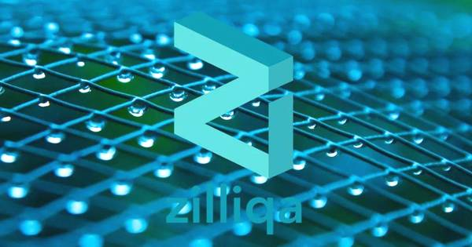

# Awesome-Zilliqa

A curated list of awesome Zilliqa frameworks, libraries, and resources.

点击[这里](./Documents/README.md)查看中文文档。
English documents are as follow.

## Basics

* ### Terms

  * [Blockchain](https://en.wikipedia.org/wiki/Blockchain)

  * [Decentralization](https://en.wikipedia.org/wiki/Decentralization)

  * [Concensus Mechanisms](https://medium.com/the-daily-bit/9-types-of-consensus-mechanisms-that-you-didnt-know-about-49ec365179da)

  * [Sharding](https://medium.com/edchain/what-is-sharding-in-blockchain-8afd9ed4cff0)

  * [Cryptocurrency](https://en.wikipedia.org/wiki/Cryptocurrency)

  * [Bitcoin](https://en.wikipedia.org/wiki/Bitcoin)

  * [Digital Signature](https://en.wikipedia.org/wiki/Digital_signature)

  * [Smart Contract](https://en.wikipedia.org/wiki/Smart_contract)

  * [Token](https://en.bitcoinwiki.org/wiki/Token)

  * [Mining](https://en.bitcoin.it/wiki/Mining)

    

* ### Theory

  * [Bitcoin: A Peer-to-Peer Electronic Cash System](https://bitcoin.org/bitcoin.pdf)

## Documents

* ### Introduction

  * [Official Website](https://zilliqa.com/)
  * [Zilliqa Blog](https://blog.zilliqa.com/@xinshu)
  * [Zilliqa Whitepaper v1.0](https://docs.zilliqa.com/whitepaper.pdf)

  

* ### Technical Docs

  * [SCILLA Technical paper](https://arxiv.org/pdf/1801.00687.pdf)
  * [Scilla-docs](http://scilla.readthedocs.io/en/latest/)
    * [Introduction](http://scilla.readthedocs.io/en/latest/intro.html)
    * [Scilla trial](http://scilla.readthedocs.io/en/latest/scilla-trial.html)
    * [Scilla by example](http://scilla.readthedocs.io/en/latest/scilla-by-example.html)
    * [Scilla in depth](http://scilla.readthedocs.io/en/latest/scilla-in-depth.html)
      - [Structure of a Scilla Contract](http://scilla.readthedocs.io/en/latest/scilla-in-depth.html#structure-of-a-scilla-contract)
      - [Primitive Data Types & Operations](http://scilla.readthedocs.io/en/latest/scilla-in-depth.html#primitive-data-types-operations)
      - [Algebraic Data Types (ADTs)](http://scilla.readthedocs.io/en/latest/scilla-in-depth.html#algebraic-data-types-adts)
    * [Interface](http://scilla.readthedocs.io/en/latest/interface.html)
  * [JSON-RPC](https://apidocs.zilliqa.com/#introduction)
    * [GetBalance](https://apidocs.zilliqa.com/#getbalance)
    * [GetDsBlock](https://apidocs.zilliqa.com/#getdsblock)
    * [GetTxBlock](https://apidocs.zilliqa.com/#gettxblock)
    * [GetLatestDsBlock](https://apidocs.zilliqa.com/#getlatestdsblock)
    * [GetLatestTxBlock](https://apidocs.zilliqa.com/#getlatesttxblock)
    * [GetTransaction](https://apidocs.zilliqa.com/#gettransaction)
    * [CreateTransaction](https://apidocs.zilliqa.com/#createtransaction)
    * [GetSmartContracts](https://apidocs.zilliqa.com/#getsmartcontracts)
    * [GetSmartContractState](https://apidocs.zilliqa.com/#getsmartcontractstate)
    * [GetSmartContractCode](https://apidocs.zilliqa.com/#getsmartcontractcode)
    * [GetSmartContractinit](https://apidocs.zilliqa.com/#getsmartcontractinit)
    * [GetBlockchainInfo](https://apidocs.zilliqa.com/#getblockchaininfo)
    * [GetNetworkId](https://apidocs.zilliqa.com/#getnetworkid)
    * [GetRecentTransactions](https://apidocs.zilliqa.com/#getrecenttransactions)
    * [DSBlockListing](https://apidocs.zilliqa.com/#dsblocklisting)
    * [TxBlockListing](https://apidocs.zilliqa.com/#txblocklisting)

  

* ### Financial Grant

  * [Financial Grant](https://blog.zilliqa.com/buildonzil-introducing-the-zilliqa-ecosystem-grant-programme-6ccb98892712)

    

* ### Contact
  * [*Twitter*](https://twitter.com/zilliqa)
  * [*Slack*](https://invite.zilliqa.com/)
  * [*Telegram*](https://t.me/zilliqachat)
  * [*Reddit*](https://www.reddit.com/r/zilliqa/)
  * [*Gitter*](https://gitter.im/Zilliqa/ecogrant)

## Github

### Official Repos

* [Zilliqa](https://github.com/Zilliqa/Zilliqa)
* [Zilliqa-JavaScript-Library](https://github.com/Zilliqa/Zilliqa-JavaScript-Library)
* [Zilliqa-Wallet](https://github.com/Zilliqa/Zilliqa-Wallet) 

### 

### Web3

**1. [Web3.js by FireStack](https://github.com/FireStack-Lab/webz.js)** - Web3.js is a collection of libraries which will allow you to interact with a local or delegated Zilliqa node.

**2. [Web3.go by Ginco](https://github.com/GincoInc/zillean)** - Go version of Web3 libraries.

### **Wallets**

**1. Swift Wallet by Alexander Cyon** - An iOS wallet for sending/receiving ZIL native tokens and interacting with smart contracts.

https://github.com/OpenZesame/Zilliqa-Swift-SDK

https://github.com/OpenZesame/Zilliqa-Wallet-iOS

https://github.com/Sajjon/SwiftCrypto

**2. [A Secure Multi-party Computation (SMPC) Protocol Wallet by Kzen Networks](https://github.com/KZen-networks)** - A wallet based on applying Secure Multi-party Computation to distribute key generation and transaction signing to multiple parties with no change to the Zilliqa protocol.

**3. [Unity Wallet by Jonas Jia](https://github.com/jonas0110/unity3d-zilliqa-wallet)** - A Unity3D gaming engine wallet for game developers to utilise in order to create blockchain-based games.

### **Extensions**

**1. [Browser Extension by Greenrain](https://github.com/qaidjohar/Zilliqa-Browser-Extension)** - A Chrome Web extension for sending/receiving ZIL native tokens and interacting with smart contracts on the Zilliqa blockchain.

**2. [Web Extension](https://github.com/appbery/Zilliqa-Chrome-Wallet)** - A Chrome Web extension for sending/receiving ZIL native tokens and interacting with smart contracts on the Zilliqa blockchain.

### **Libraries**

**1. [Smart contract libraries by Merkalize](https://github.com/vaibhavchellani/scilla-vanilla)** - A repository of reusable smart contracts for smart contract developers to utilise in their dApp development.

### **Scilla Language Server**

**1. [Scilla Language Server implementation](https://github.com/czarly/scilla-language-server)** - A language analyzer for Scilla that enables code completion/hover/diagnostics etc., for your favorite IDE.

### **Games**

**1. [EMONT Frenzy by EMONT Alliance](https://github.com/Etheremonn/emont-frenzy)** - A decentralised underwater game where players enter as fish to collect tokens and battle with others.

**2. [The World of Swordsmen](https://github.com/jonas0110/zilwuxia)** - Relive the ancient Chinese dynasty as warriors in this fantasy MMORPG game. Collectibles like secret manuals and weapons are tradeable in tokenized form and your legacy is etched forever on the Zilliqa blockchain.

### **Other Applications**

**1. [BTCT期货](https://github.com/DRI-network/)** - A cross-chain protocol for BTC Token issuance on the Ethereum network and Zilliqa network. Zilliqa’s smart contracts to be utilised to fully support Swingby’s Futures contracts and atomic swaps.
